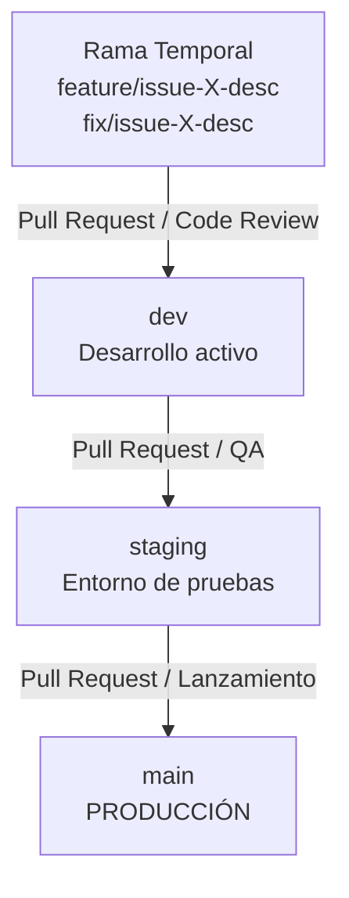

# Política y Flujo de Trabajo en Git (Git Workflow) — BUCA Recubrimientos

Este documento establece la metodología obligatoria de control de versiones y despliegue para garantizar la estabilidad y trazabilidad del cotizador de BUCA, previniendo caídas accidentales en producción (`main`).

---

## 📌 1. Arquitectura de Ramas (Branches)

El repositorio está estructurado en 3 entornos/ramas permanentes y ramas temporales de desarrollo:



### 🔴 `main` (Producción)
*   **Propósito:** Contiene el código estable e idéntico al que utiliza el usuario final en producción.
*   **Regla:** **Queda estrictamente prohibido realizar commits directos a `main`.**
*   **Despliegue:** Se despliega automáticamente a producción mediante Cloudflare al recibir actualizaciones únicamente por Pull Requests aprobados desde `staging`.

### 🟡 `staging` (Pruebas / Pre-producción)
*   **Propósito:** Entorno idéntico a producción utilizado para control de calidad (QA), pruebas de regresión e integración final.
*   **Regla:** Solo recibe cambios a través de Pull Requests de sincronización desde `dev`.
*   **Despliegue:** Se despliega a un subdominio de pruebas (ej: `staging.cotizador.bucamx.com`) para validación antes de lanzar a producción.

### 🔵 `dev` (Desarrollo Activo)
*   **Propósito:** Rama de integración para desarrollo. Aquí se consolidan todas las nuevas características antes de ser probadas a fondo.
*   **Regla:** Solo recibe cambios aprobados de ramas de características (`feature/*`) o corrección de fallos (`fix/*`). No se escribe código directamente aquí si es una funcionalidad grande.

### 🟢 Ramas Temporales (`feature/*`, `fix/*`, `chore/*`)
*   **Origen:** Siempre se ramifican a partir de `dev`.
*   **Nomenclatura:**
    *   Nuevas funciones: `feature/issue-<número>-<nombre-corto>` (Ej: `feature/issue-12-s3-upload`)
    *   Corrección de errores: `fix/issue-<número>-<nombre-corto>` (Ej: `fix/issue-15-error-zero`)
    *   Mantenimiento: `chore/<nombre-corto>` (Ej: `chore/clean-logs`)
*   **Destino:** Al finalizar la tarea, se abre un Pull Request (PR) apuntando a `dev`.

---

## 🔄 2. Ciclo de Trabajo Paso a Paso

### Paso 1: Crear el Issue en GitHub
Antes de iniciar cualquier desarrollo, se debe crear un **Issue** en el repositorio para detallar el problema, requerimientos o tarea a realizar. Esto asigna un número identificador (ej: `#42`).

### Paso 2: Crear la Rama de Desarrollo
Desde tu entorno local, actualiza la rama `dev` y crea la nueva rama de trabajo:
```bash
git checkout dev
git pull origin dev
git checkout -b feature/issue-42-descripcion-corta
```

### Paso 3: Guardar el Trabajo y hacer Push
Realiza commits descriptivos con el correo configurado y sube la rama al repositorio:
```bash
git add .
git commit -m "feat: implementar componente X para issue #42"
git push origin feature/issue-42-descripcion-corta
```

### Paso 4: Crear un Pull Request hacia `dev`
1. Abre tu repositorio en GitHub y crea un **Pull Request** de tu rama hacia `dev`.
2. Asocia el PR con el issue correspondiente escribiendo `Closes #42` en la descripción.
3. Una vez aprobado y verificado que no rompe las pruebas automatizadas, se mezcla (Merge) a `dev`.

### Paso 5: Promoción a `staging`
Cuando se acumulen suficientes cambios en `dev` listos para ser probados por el equipo, se abre un PR de **`dev` hacia `staging`**.
El equipo comercial o de QA valida el correcto funcionamiento de las características en el entorno de pruebas.

### Paso 6: Lanzamiento a `main` (Producción)
Tras la validación exitosa en `staging`, se abre un PR de **`staging` hacia `main`**. Al mezclarse, Cloudflare compilará y actualizará el sitio en producción sin interrupción de servicio y de manera 100% segura.
